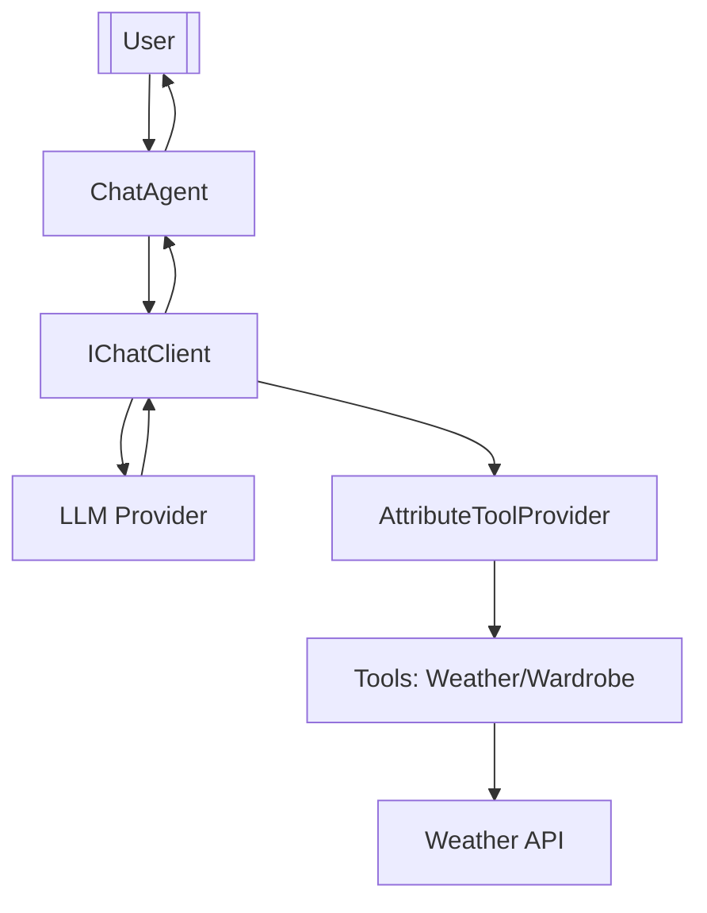
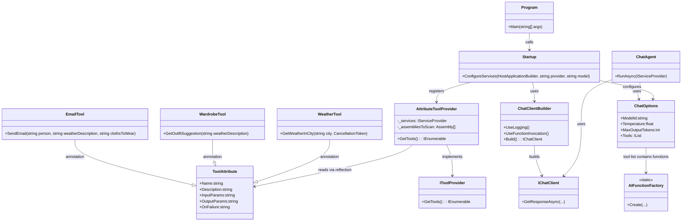
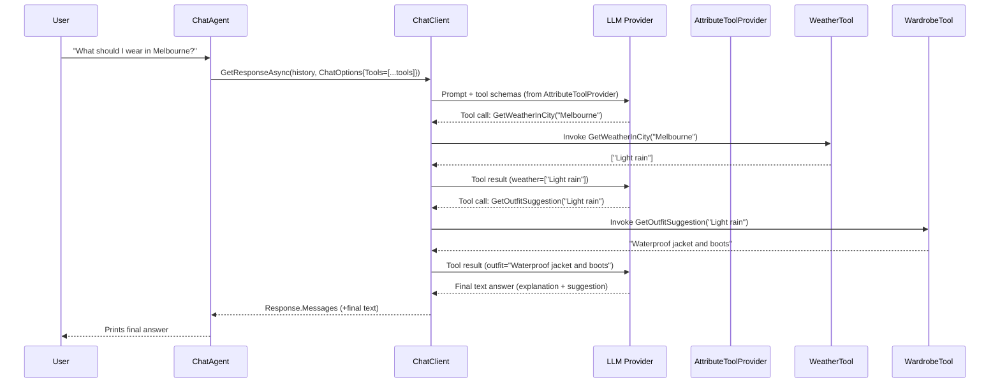

# Big picture

This is a **console chat app** built on **Microsoft.Extensions.AI** with **pluggable LLM providers** and a **tooling system** discovered via a custom `[Tool]` attribute. You run it, it spins up DI, chooses a model/provider, discovers tool functions, and then the chat loop asks the model to answer user messages—calling tools when needed.

if you run the app and ask

"What is the weather in the {city} and what clothes should I wear"

it should invoke the functions and give you answer


# What lives where (the important bits)

```
MicrosoftAIExtension/
├─ Program.cs                          // Entry point: args parsing, host building, start ChatAgent
├─ Startup.cs                          // DI wiring: IChatClient, tools, ChatOptions, logging
├─ Agents/
│  └─ ChatAgent.cs                     // Console loop: maintains history, calls chatClient.GetResponseAsync(...)
├─ ToolInfrastructure/
│  ├─ AttributeToolProvider.cs         // Scans assemblies for [Tool] methods → AIFunctions
│  ├─ FunctionRegistry.cs              // Facade to fetch tools from provider
│  └─ ToolAbstractions/
│     └─ IToolProvider.cs              // Interface for pluggable tool providers
│  └─ ToolAttributes/
│     └─ ToolAttribute.cs              // [Tool] metadata used by the scanner
├─ Tools/
│  ├─ WeatherTool.cs                   // Example tool (calls weatherapi.com)
│  └─ WardrobeTool.cs                  // Example tool (maps weather description → outfit)
└─ .env                                // Provider keys & config (loaded via dotenv)
```


# Components & responsibilities



## 1) Program (composition root)

* **Loads environment** with `DotEnv.Load()`.
* **Parses CLI args**: `--provider` and `--model` (defaults: `openai`, `gpt-4o`).
* **Builds Host** via `Host.CreateApplicationBuilder(args)` then calls `Startup.ConfigureServices(...)`.
* **Runs ChatAgent** with DI container.

Think of it as the **wiring foreman**.

## 2) Startup (dependency injection & configuration)

* Registers **console logging** (`Information` min level).
* Registers the **LLM client** (`IChatClient`) based on your chosen provider/model.

  * You’ve referenced `GeminiDotnet` + `GeminiDotnet.Extensions.AI`. With OpenAI you’d similarly register the OpenAI adapter for `IChatClient`.
* Registers **IToolProvider** → `AttributeToolProvider`.
* Registers **ChatOptions** (`ModelId`, `Temperature`, `MaxOutputTokens`, and crucially **Tools = \[..FunctionRegistry.GetTools(sp)]**).

Think of it as the **service menu**: what provider/model, what tools, and how the chat client should behave.

## 3) Tool system (attribute-driven “function calling”)

* **\[Tool] attribute** (in `ToolAttribute.cs`): adds human-readable metadata (name, description, param docs, return docs, on-failure guidance).
* **AttributeToolProvider**: scans loaded assemblies (excluding dynamic) for methods tagged with `[Tool]`, and wraps them as `AIFunction`s that **Microsoft.Extensions.AI** can expose to the model for tool calling.
* **FunctionRegistry**: tiny facade so consumers can simply do `[..FunctionRegistry.GetTools(sp)]`.

This is your **plug-in bus**. Drop in any class with methods tagged `[Tool]`, DI will discover it, and the model can call it.

### Example tools

* `WeatherTool.GetWeatherInCity(string city, CancellationToken)`
  Calls `https://api.weatherapi.com/v1/current.json` using an API key from environment, returns `string[]` of weather description(s).
* `WardrobeTool.GetOutfitSuggestion(string weatherDescription)`
  Pure function mapping descriptions (sunny/rain/rain...) to human tips (“windbreaker”, “umbrella”, etc.).

## 4) ChatAgent (runtime loop)

* Builds/maintains a **chat history** (`List<ChatMessage>`).
* Reads user input from console, appends to history as **User** message.
* Calls `chatClient.GetResponseAsync(history, chatOptions)`.

  * The underlying **Extensions.AI** stack lets the model **propose tool invocations** (function calling).
  * If a tool is invoked, the plumbing executes your C# method and passes results back to the model for a final answer.
* Prints the model’s final text, then appends the model’s messages back into the history (so it “remembers” context).

It’s your **orchestra conductor**: it doesn’t know weather or outfits; it just lets the model pull the right instrument.

# How a request actually flows

## Sequence (happy path, with a tool call)



**Key idea:** The **model** decides when to call tools. Your attribute system merely exposes *what’s callable* and *how*.

# Configuration & environment

* **.env** is loaded at startup. Keep provider secrets (OpenAI key, Gemini key, Weather API key) here.
* `WeatherTool` requires `WEATHER_API_KEY` and will throw if missing.
* CLI flags:

  * `--provider`: e.g., `openai`, `gemini`
  * `--model`: e.g., `gpt-4o`, `gemini-1.5-pro`

# Logging

* Console logging at **Information**. That’s useful while building; bump to **Debug** when you want tool call traces or provider selection nudges. If you’re not seeing `LogInformation`, make sure:

  1. The logger is **injected** into classes that log (e.g., `ChatAgent` or tools)
  2. You’re not swallowing logs by replacing the provider pipeline later
  3. `SetMinimumLevel(LogLevel.Information)` remains in effect and isn’t overridden elsewhere

# Extensibility blueprint

## Add a new tool

1. Create a class (DI-friendly if you need services injected).
2. Add a method and decorate it with `[Tool(Name=..., Description=...)]`. Keep input/output types **simple/serializable**.
3. If it needs configuration (API keys, base URLs), inject via ctor from `IConfiguration` or options.
4. Done—**no registry edit needed**. The attribute scanner picks it up.

## Add a new provider

* In `Startup`, branch on `provider`/`model` to register the correct `IChatClient` implementation (OpenAI, Gemini, Azure OpenAI, etc.). Your code already references Gemini; wiring OpenAI is symmetrical via the `Microsoft.Extensions.AI` adapters.

## Tune model behavior

* Tweak `ChatOptions`:

  * `Temperature` (creativity vs. determinism)
  * `MaxOutputTokens`
  * **System prompts** (if you add one) to set persona/policy
  * **Tools** list (you can filter tools per run if needed)


# Opinionated guidance (so it scales)

* **Keep tools pure** when possible (no hidden global state). It makes the model’s outputs more predictable and easier to test.
* **Validate inputs** in tools and throw meaningful exceptions. The model can learn from your error messages and self-correct on the next call.
* **Name & describe tools concretely**. The model’s tool selection is strongly driven by the `Name` + `Description`.
* **Separate concerns**: provider wiring stays in `Startup`; conversation logic in `ChatAgent`; tool discovery in `AttributeToolProvider`; domain logic in `Tools/*`.
* **Consider a “Tool SDK”** class to DRY common patterns (HTTP client policies, JSON parsing helpers, retries/timeouts).

If you want, I can generate a polished set of Mermaid diagrams (component + sequence) tailored to your exact provider choice and any extra tools you plan to add next—just tell me which providers you want to show (OpenAI, Gemini, Azure OpenAI) and whether you want resilience features (retry/backoff) drawn in.


Here’s a structured overview of the project’s architecture and control flow, with pointers on what components you might want to draw in your diagrams:

### High-level structure

This is a **.NET console chat application** built on top of the new **Microsoft Extensions AI** abstractions. The library allows you to call an LLM (OpenAI, Gemini, etc.) without binding to a specific SDK. A key feature is its support for **function‑calling**: the model can call your own .NET methods to fetch data or perform actions. The Microsoft documentation describes how a console AI chat app can use these abstractions to change underlying models easily.

The main components are:

| Component                    | Responsibility                                                                                                                                                                                                           |
| ---------------------------- | ------------------------------------------------------------------------------------------------------------------------------------------------------------------------------------------------------------------------ |
| **Program.cs**               | Reads command‑line arguments to select provider and model; builds the `Host` and starts `ChatAgent`                                                                                                                      |
| **Startup.cs**               | Configures dependency injection: registers a logger, picks the correct `IChatClient` implementation (OpenAI or Gemini), registers the `WeatherTool` and tool discovery, and sets up `ChatOptions` with the list of tools |
| **ChatAgent.cs**             | Runs the console loop: maintains chat history, reads user input, calls `chatClient.GetResponseAsync(history, chatOptions)` and displays the answer                                                                       |
| **Tools**                    | Domain‑specific functions (e.g. `WeatherTool.GetWeatherInCity`, `WardrobeTool.GetOutfitSuggestion`) decorated with `[Tool]` attributes so the model can call them                                                        |
| **AttributeToolProvider.cs** | Scans all assemblies for methods marked with `[Tool]` and wraps them as `AIFunction`s so the chat client knows how to invoke them                                                                                        |

### Control flow (request cycle)

1. **App startup:** `Program` loads environment variables and parses `--provider`/`--model`. It builds a host using `Startup.ConfigureServices`.
2. **Dependency injection:** `Startup` sets up logging and registers a singleton `IChatClient` using either an OpenAI or Gemini adapter. Microsoft documentation shows that the `ChatClient` can be configured with `.UseFunctionInvocation()`, which enables automatic tool/function calls.
3. **Tool registration:** `Startup` registers the `AttributeToolProvider` which scans for `[Tool]` methods. It also creates a `ChatOptions` instance whose `Tools` list comes from the provider. When you add a `[Tool]` method, no further code changes are needed—just drop it in and the scanner discovers it.
4. **Chat loop:** `ChatAgent` prompts the user and appends each user message to a history list. It then calls `chatClient.GetResponseAsync(history, chatOptions)`. If the model decides a tool is needed, it calls the registered method. This capability is documented by Microsoft: you can supply a `ChatOptions` object with a list of functions (tools) the model can call.
5. **Tool invocation:** The `AttributeToolProvider` uses reflection to create `AIFunction` objects for each `[Tool]` method. The underlying chat client will serialize arguments, call the C# method, capture the result, and return it to the model. The model receives the result and produces a final answer. Microsoft’s quickstart explains that the app uses `ChatOptions` with functions, and the model automatically calls them to answer the question.
6. **Response:** The final text (and any extra messages from the model) is printed to the console. The history is updated so the context is preserved.

### Suggestions for diagrams

To visualise the system, you can create:

* **Component diagram:** Show how `Program`, `Startup`, `ChatAgent`, `AttributeToolProvider` and the individual tool classes relate. Also indicate the injected `IChatClient` and how the model calls back into your tools.
* **Sequence diagram:** Detail the runtime sequence: user input → `ChatAgent` → `IChatClient` → model → potential tool call → tool execution → model → response. Include the call to `GetResponseAsync` and the automatic tool invocation.
* **Configuration/deployment view:** Represent environment variables (.env file), CLI arguments, and DI setup in `Startup`.

These diagrams will help illustrate the project’s extensibility and how tools are seamlessly exposed to the model.
